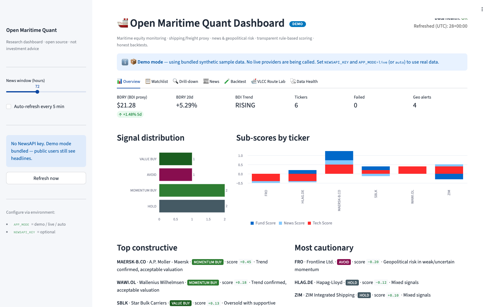
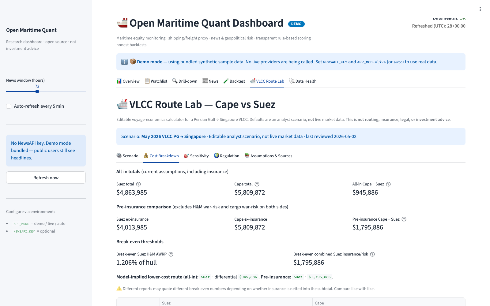

# 🚢 Open Maritime Quant Dashboard

[](https://www.python.org/)
[](https://streamlit.io/)
[](LICENSE)
[](sample_data/)

An open-source research dashboard for monitoring maritime equities. It
combines free-tier price and fundamental data, news sentiment, and a
**transparent rule-based signal engine**, with a Streamlit UI, an
honest backtest, and bundled synthetic sample data so anyone can clone
the repo and see it working in seconds.

> **Not investment advice.** Signals are rule-based and unvalidated.
> Free-tier data feeds are unreliable. Use at your own risk.

---

## Screenshots





Screenshots are captured in demo mode so they contain no secrets or proprietary
live data. To refresh them, follow the
[walkthrough in `docs/screenshots/`](docs/screenshots/README.md).

## Run with the launcher

A small Tkinter launcher is included for non-technical users:

```bash
python3 launcher.py
```

It shows the detected mode (DEMO/LIVE/AUTO), whether a NewsAPI key is
configured (boolean only — never the value), and offers buttons for
**Run Demo / Run Live / Run Auto / Stop / Open localhost / Smoke test /
Run tests / Doctor / Security check / Open README**. If Tkinter is
unavailable (headless environment), it falls back to a numbered terminal
menu.

The launcher selects the next free port automatically if `8501` is busy.

---

## Features

- **Seven-tab Streamlit UI**: Overview, Watchlist, Drill-down, News, Backtest, **VLCC Route Lab**, Data Health.
- **Three modes**: `demo` (bundled synthetic data, no keys, no network), `live` (yfinance + NewsAPI), `auto` (live if `NEWSAPI_KEY` is set, else demo). A `fallback` badge appears whenever a live provider fell back to sample data mid-run.
- **Transparent rule-based signal engine** with sub-scores (technical, fundamental, news), confidence, risk score, and explicit data-quality warnings — no opaque ML claims.
- **Honest backtest** with no lookahead bias, configurable commission/slippage, full trade ledger, equity + drawdown charts, and a buy-and-hold benchmark.
- **VLCC Route Lab** — Cape vs Suez voyage-economics calculator with editable scenario inputs, EU ETS scope validator, sensitivity matrix, scrubber spread analysis, and break-even AWRP solver. Defaults are an *editable analyst scenario*, not live market data.
- **Provider health surface**: every external call returns a structured status (success / records / sanitised error / timestamp), with call counts and sample-fallback flags visible in the Data Health tab.
- **Public-deploy ready**: Dockerfile, docker-compose, GitHub Actions CI, and CSV export.

---

## Live demo

The repo is structured so a public demo on **Streamlit Community Cloud** or
**Hugging Face Spaces** can run directly from `main` with no API key (it
falls back to demo mode automatically). See [Deployment](#deployment).

---

## Quick start

### Demo mode (no keys, no network)

```bash
git clone <this repo>
cd SharepricemovementMaritime-main
python3 -m venv .venv && source .venv/bin/activate
pip install -r requirements.txt
APP_MODE=demo python3 -m streamlit run dashboard.py
```

Open <http://localhost:8501>. The header will show a blue **DEMO** badge.

### Live mode (with NewsAPI)

```bash
cp .env.example .env       # then edit .env to set NEWSAPI_KEY
python3 -m streamlit run dashboard.py
```

The header will show a green **LIVE** badge. If a live provider fails
mid-run, the badge flips to amber **FALLBACK** and the failed call is
substituted with sample data so the dashboard stays alive.

### Make targets

```bash
make install     # pip install -r requirements.txt
make test        # pytest -q
make smoke       # one-ticker live smoke test (no secrets printed)
make run         # streamlit run on port 8501 (auto mode)
make run-demo    # APP_MODE=demo streamlit run
make compile     # py_compile every source file
```

---

## Docker

The image runs Streamlit headless on port `8501` and exposes a
`/_stcore/health` endpoint used by the `HEALTHCHECK`.

### Demo mode (no keys, no network)

```bash
docker build -t open-maritime-quant:latest .
docker run --rm -p 8501:8501 -e APP_MODE=demo open-maritime-quant:latest
```

### Live mode (keys via env, never baked in)

```bash
docker run --rm -p 8501:8501 \
  -e APP_MODE=live \
  -e NEWSAPI_KEY="$NEWSAPI_KEY" \
  open-maritime-quant:latest
```

Or via Compose (reads env vars from your shell or a local `.env` —
which stays gitignored):

```bash
APP_MODE=demo docker compose up --build
```

> **Never bake secrets into the image.** They live forever in image
> layers. Always pass them at run-time via `-e`, `--env-file`, or your
> orchestrator's secret store.

> **Local Docker testing isn't always available.** This repo's CI
> exercises imports, tests, and the static security scan — not the
> Docker build. If you publish a container, run a quick smoke yourself
> with `docker run … APP_MODE=demo` before announcing it.

---

## Environment variables

| Variable | Default | Purpose |
|----------|---------|---------|
| `APP_MODE` | `auto` | `demo` / `live` / `auto` |
| `NEWSAPI_KEY` | _(unset)_ | NewsAPI.org key. Free tier: ~100 req/day, dev only |
| `BALTIC_EXCHANGE_KEY` | _(unset)_ | Placeholder for Baltic Exchange freight indices |
| `CLARKSONS_KEY` | _(unset)_ | Placeholder for Clarksons TCE / fleet data |
| `VESSELSVALUE_KEY` | _(unset)_ | Placeholder for VesselsValue / FVG inputs |
| `KPLER_KEY` | _(unset)_ | Placeholder for Kpler cargo flow |
| `MARINETRAFFIC_KEY` | _(unset)_ | Placeholder for AIS positions |

The dashboard only ever reports **"NewsAPI key detected"** vs. **"No
NewsAPI key set"** — values are never printed or logged.

---

## Data providers

| Source | Used for | Notes |
|--------|----------|-------|
| **yfinance** | Daily prices, fundamentals, fallback news | Free tier; rate-limited and occasionally schema-broken. Pinned to `yfinance==1.3.0` in this repo. |
| **NewsAPI** | Primary news source in live mode | Free tier is dev-only and quota-limited. **Production / public deployments should use a paid plan or an alternate news provider.** |
| **BDRY ETF** | Public proxy for the Baltic Dry Index | Correlated, not identical. The actual BDI requires a Baltic Exchange license. |
| **sample_data/** | Demo + fallback fixtures | Synthetic, deterministic, clearly labelled. Not real market or news data. |

### Paid maritime providers (placeholders only)

The Data Health tab lists Baltic Exchange, Clarksons, VesselsValue,
Kpler, and MarineTraffic as **"not configured"** until you supply a key.
None of these are integrated yet — the placeholders exist so the
dashboard is honest about what it has and doesn't have. TCE rates, FVG,
vessel valuations, and AIS data **are not available from free sources**;
do not infer them from this dashboard.

---

## Methodology

### Indicators

RSI(14), SMA(20/50/200), 5-day return, 20-day return, 20-day
volatility, drawdown from 3-month high, trend classifier, volume
trend. All thresholds and windows live in `config.py`.

### Signal engine

The engine is **rule-based**, not ML. For each ticker it produces:

- `signal_score` (composite, range -1..+1)
- `technical_score`, `fundamental_score`, `news_score` (sub-scores)
- `risk_score` (0..1; higher = riskier)
- `confidence` ∈ {low, medium, high} based on evidence vs. data warnings
- `geo_risk` boolean
- `evidence`, `risk_warnings`, `data_warnings` (separate lists)
- `label` ∈ {`VALUE BUY`, `MOMENTUM BUY`, `HOLD`, `PROFIT TAKE`, `SELL`, `STRONG SELL`, `AVOID`}

Composite weighting is `0.45 × technical + 0.35 × fundamental + 0.20 × news`,
overridden by a geo-risk veto when momentum is weak. Thresholds (RSI bands,
P/B, D/E, EV/EBITDA, current ratio) are all configurable.

### Backtest assumptions

- Long-only, single fixed-stake position.
- Entry at close of bar T: `SMA20 > SMA50` **and** `40 < RSI < 65`.
- Exit at close of bar T: `SMA20 < SMA50` **or** `RSI > 75`.
- **Orders fill at the next bar's open** — eliminates lookahead bias.
- Each side pays `commission_bps + slippage_bps` (10 + 5 by default).
- **Technical-only.** Free historical fundamentals/news aren't
  point-in-time, so including them would risk leakage. We don't fake it.

### Limitations

- Past performance does not guarantee future results.
- The signal engine has not been validated against a benchmark on
  out-of-sample data. Treat it as research scaffolding, not a strategy.
- Free yfinance and NewsAPI tiers are unreliable and quota-limited.
- BDRY is a public proxy for BDI; it is not the index itself.
- TCE / FVG / vessel valuations / AIS data require paid providers.

---

## VLCC Route Lab

A second module: a deterministic voyage-economics calculator for VLCC
tanker routing (Persian Gulf → Singapore by default), comparing **Cape
of Good Hope vs Suez Canal**.

### What it computes

Per route, the model breaks total cost into:

- Fuel (sea-days × consumption × price; scrubber adjustment optional).
- Tolls / port fees.
- Charter hire (voyage-day opportunity cost).
- Congestion delay cost (additional charter days, Cape-only by default).
- Cargo financing (cargo value × annual rate × sea-days / 365).
- Hull & Machinery war-risk premium (% of hull value, route-specific).
- Cargo war-risk premium (% of cargo value, route-specific).
- Carbon cost = physical CO₂ × ETS coverage × EUA price.

It also outputs three different views of the comparison so you don't
mix them up:

- **All-in Cape − Suez differential** — current totals with whatever
  insurance percentages you entered. This is the headline number.
- **Pre-insurance differential** — Cape and Suez totals with H&M and
  cargo war-risk excluded on both sides. Captures the "how much extra
  Suez risk-cost can be tolerated before Cape wins" framing some
  briefs use.
- **Break-even Suez H&M AWRP (% of hull)** — the H&M war-risk
  percentage on Suez (given all other current assumptions) at which
  the all-in totals tie. Independent of `cargo_awrp_*` only when both
  Cape values are zero.
- **Break-even combined Suez insurance/risk (USD)** — the total Suez
  war-risk USD that would tie the routes given Cape's current
  insurance assumption. Closer to the framing in some analyst briefs
  (e.g. "$1.77m"-style thresholds). **Negative** ⇒ Cape is already
  cheaper before any Suez insurance is applied.

Why two break-even numbers? Different reports treat insurance
differently. If a brief quotes a USD threshold, it usually means
**combined Suez insurance/risk**. If it quotes a percentage of hull, it
usually means **Suez H&M AWRP**. Compare like with like.

Other outputs:

- Sensitivity matrix across charter-rate × fuel-price grids.
- Scrubber spread analysis (HSFO vs VLSFO).

### EU ETS scope

The model implements the EU maritime ETS scope rules:

| Voyage type | Coverage |
|-------------|----------|
| EEA ↔ EEA | 100% |
| EEA ↔ non-EEA (or any intermediate EEA port call) | 50% |
| non-EEA ↔ non-EEA | 0% |

A direct PG → Singapore voyage is **non-EEA ↔ non-EEA → 0% coverage**,
so the EUA price input does not affect payable carbon cost. Physical
emissions are still reported.

Sources:

- European Commission — *FAQ — Maritime transport in the EU Emissions
  Trading System (ETS)*: <https://climate.ec.europa.eu/eu-action/eu-emissions-trading-system-eu-ets/maritime-transport-eu-emissions-trading-system_en>
- EMSA — *Maritime ETS*: <https://www.emsa.europa.eu/eu-mrv/eu-mrv-policy.html>
- Directive (EU) 2023/959 (extending the EU ETS to maritime transport).

From 1 January 2026 the phase-in is over and 100% of regulated emissions
are surrendered annually.

### Default scenario

`sample_data/route_scenarios/may_2026_vlcc_pg_singapore.json` ships with
an analyst scenario based on a teammate's brief. **Every value is
editable in the dashboard.** The file labels itself as
"Editable analyst scenario, not live market data" with explicit
source/citation fields. Bunker prices, charter rates, AWRP %, port
congestion, and EUA prices are placeholders — see the **Roadmap**.

### What's a model assumption vs verified data

The Assumptions & Sources sub-tab colour-codes every input as one of:

- 🔵 **user_input** — set on the Scenario sub-tab.
- 🟠 **analyst_default** — provisional from the scenario JSON; verify.
- 🟢 **regulatory_constant** — sourced from a regulator (e.g. ETS scope).
- ⚪ **vessel_default** — engineering / accounting placeholders.

### Disclaimers

- This is a **calculator**, not routing, insurance, legal, or
  investment advice.
- Bunker, toll, war-risk, congestion, and freight feeds are **not**
  wired to live data. The Data Health tab lists them as
  "not configured".
- Insurance assumptions (AWRP, withdrawal of cover, JWC listed-areas)
  are deliberately user-editable. Real underwriter quotes vary
  materially by hull, voyage, and current threat reports.

---

## Roadmap

Concrete extensions (in roughly increasing implementation cost):

- [ ] Live bunker pricing provider (Ship & Bunker, Argus, Platts).
- [ ] Suez toll calculator using SCNT-based formula and SCA circulars.
- [ ] War-risk premium provider (broker feeds, JWC listed-areas).
- [ ] Port congestion provider (Cape/anchorage waiting times).
- [ ] Live freight / TCE provider (Baltic Exchange, Clarksons).
- [ ] Route distance / AIS routing API (sea-distances.org, MarineTraffic).
- [ ] Scenario sharing via URL/query params.
- [ ] PDF report export of a Route Lab scenario.
- [ ] Out-of-sample evaluation pipeline for the equity signal engine.

The provider scaffolding already exists: see `config.PAID_PROVIDERS`
and `providers.paid_provider_status()`. New integrations should add a
typed function in `providers.py` that returns `(payload, ProviderStatus)`,
register the env-var name in `config.py`, and surface status in the
Data Health tab.

---

## Deployment

### Streamlit Community Cloud

1. Push this repo to GitHub.
2. New app → point at `dashboard.py` on your default branch.
3. Streamlit secrets: add `NEWSAPI_KEY` and (optionally) `APP_MODE=live`.
   Leave both unset for a public demo using sample data.
4. The bundled `requirements.txt` is picked up automatically.

### Hugging Face Spaces (Streamlit SDK)

Same pattern: add `NEWSAPI_KEY` as a Space secret if you want live news.
Otherwise the app runs in demo mode automatically.

### Generic VPS / cloud

```bash
# On the host:
git clone <repo> && cd <repo>
python3 -m venv .venv && source .venv/bin/activate
pip install -r requirements.txt
NEWSAPI_KEY=xxx APP_MODE=live \
  python3 -m streamlit run dashboard.py --server.port 8501
```

Front it with nginx/Caddy and you're done. **Never bake secrets into
images or commit them to the repo.**

### Public-deploy warnings

- **NewsAPI free tier** is for development environments only. Public
  deployments using the free tier may violate the NewsAPI terms.
  Either upgrade to a paid plan, run the public deploy in `APP_MODE=demo`,
  or substitute another news provider in `providers.py`.
- The dashboard is server-side rendered by Streamlit. API keys live in
  the server's environment and never reach the browser.

---

## Testing

```bash
make test
```

All tests run offline. Live yfinance and NewsAPI calls are mocked or
replaced with the bundled sample-data path. CI runs the same suite on
Python 3.11 and 3.12.

A manual live smoke test is also available:

```bash
make smoke   # exercises live providers for one ticker; never prints keys
```

---

## Repository layout

```
config.py                # all knobs + minimal .env loader
providers.py             # data fetch with status objects + sample fallback
demo_data.py             # sample-data loader for DEMO / FALLBACK modes
indicators.py            # RSI, SMAs, returns, volatility, drawdown, trend
signals.py               # rule-based signal engine + sub-scores
backtest.py              # vectorised technical backtest, no lookahead
maritime_data.py         # aggregates everything into normalised rows
dashboard.py             # Streamlit UI (6 tabs)
sample_data/             # synthetic demo fixtures (CSV/JSON) + generator
scripts/smoke_test.py    # one-ticker live smoke test
tests/                   # pytest suite (all offline)
SharepricemovementMaritime.py  # original CLI script (preserved)
.github/                 # CI workflow + issue/PR templates
Dockerfile, docker-compose.yml, Makefile
LICENSE, CONTRIBUTING.md, SECURITY.md, CODE_OF_CONDUCT.md, CHANGELOG.md
```

---

## Pre-publish checklist

A concise checklist for shipping this repo publicly is at
[docs/PUBLISHING.md](docs/PUBLISHING.md). It covers key rotation,
diagnostics, the parent-`.git` recovery, `git init`, and deployment
secrets.

For commercial / public-audience deployments, also read
[docs/COMMERCIAL_READINESS.md](docs/COMMERCIAL_READINESS.md) — it
covers data-source licensing (NewsAPI free tier is dev-only, BDRY is
a proxy not the BDI, paid maritime feeds are placeholders), recommended
defaults (demo mode unless rights are clear), privacy, logging hygiene,
and a pre-commercial release checklist.

## Troubleshooting

### Doctor

The fastest way to diagnose a fresh clone:

```bash
python3 scripts/doctor.py     # or:  make doctor
```

It checks Python version, required files, importable dependencies,
`.env` presence + permissions, `.gitignore` coverage, project + parent
`.git` state, sample fixtures, and port `8501` availability. It never
prints API key values.

### Security check

Static audit for likely-leaked secrets in tracked files:

```bash
python3 scripts/security_check.py     # or:  make security-check
```

Returns non-zero on any finding. Findings show the file, line number,
and a redacted match (`[redacted, length=N]`) — never the value.

### Git refuses to initialise here

If `git init` or `git status` complains in this directory, Git may be
walking upward into an invalid parent `.git` file. The doctor will
flag this. The safe fix:

```bash
ls -la "$HOME/.git"        # confirm it is a regular file (not a directory)
file "$HOME/.git"           # confirm it is empty / not a real repo

# Only after you have confirmed it's not a real repo:
mv "$HOME/.git" "$HOME/.git.bak"

# Then initialise this project's repo cleanly:
cd /Users/$USER/SharepricemovementMaritime-main
git init
git add .
git commit -m "Initial open maritime dashboard"
```

The agent will not run these commands automatically — they touch a path
outside the project tree.

### Other

- **`ModuleNotFoundError`** — make sure your venv is active and
  `pip install -r requirements.txt` succeeded.
- **yfinance errors / empty data** — retry; if it persists, see
  <https://github.com/ranaroussi/yfinance/issues>. The pinned version
  `yfinance==1.3.0` is the verified one.
- **Streamlit port conflict** — the launcher picks the next free port
  automatically, or run `streamlit run dashboard.py --server.port 8502`.
- **"No NewsAPI key set"** — copy `.env.example` to `.env` and add the
  key for live mode, or just leave it for demo mode.

## Contributing

See [CONTRIBUTING.md](CONTRIBUTING.md). Short version:

- Don't fabricate live data; the sample fixtures are deliberately labelled.
- Don't add live-API tests to CI.
- Keep dependencies lean.
- Don't market it as AI/ML unless it actually is.

## Security

See [SECURITY.md](SECURITY.md). To report a vulnerability privately, open
a GitHub security advisory. **Never commit `.env`.** If a key leaks,
rotate it.

## License

[MIT](LICENSE).

---

## Disclaimer

This project is for **research and education only**. It is **not
investment advice**. Data may be delayed, incomplete, or wrong. The
public demo runs on synthetic sample data. Trade at your own risk.
